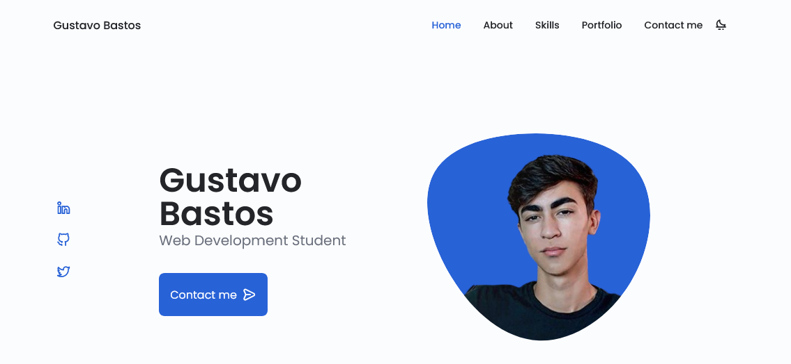
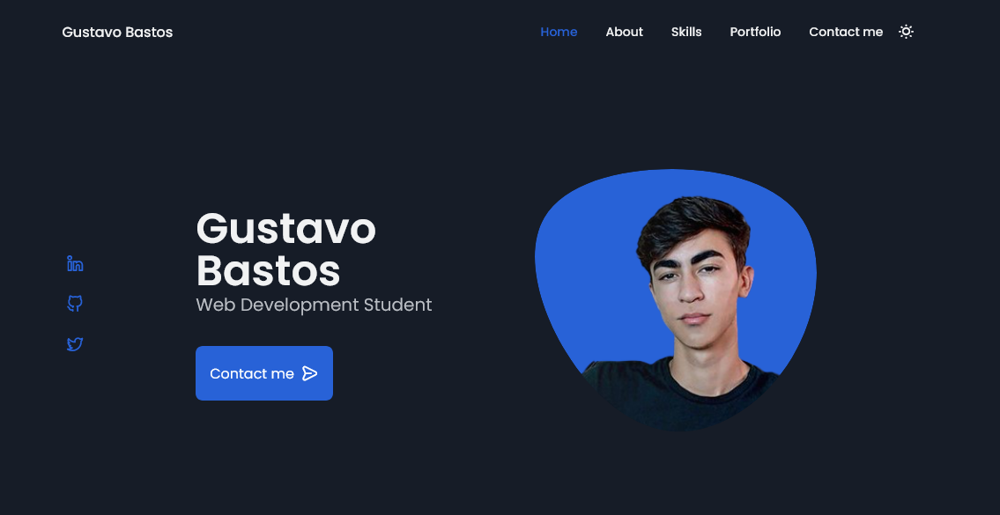

<h1 align="center">
 
    RESPONSIVE PORTFOLIO WEBSITE

</h1>

My personal page to show some knowledges that I have caught

  

## Features
Below are all features used on this project:

- **HTML5** — Standard markup language
- **CSS3** — Stylization language
- **Javascript** — Programming language
- **SwiperJS** — Modern mobile touch slider

 

## Getting started

You can clone and use the repository anytime.   
If you don't remember how, follow this GitHub official link below in order to get the doc:
https://docs.github.com/pt/github/creating-cloning-and-archiving-repositories/cloning-a-repository-from-github/cloning-a-repository

 

## License

This project is licensed under the MIT License - see the [LICENSE](https://opensource.org/licenses/MIT) page for details.

